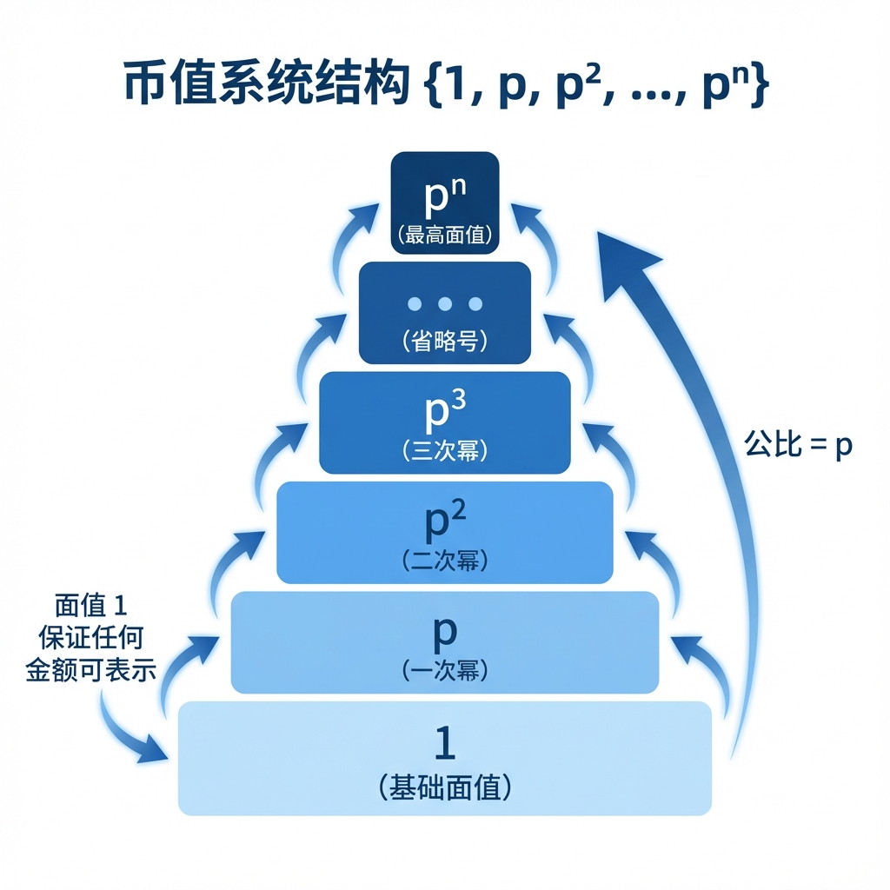
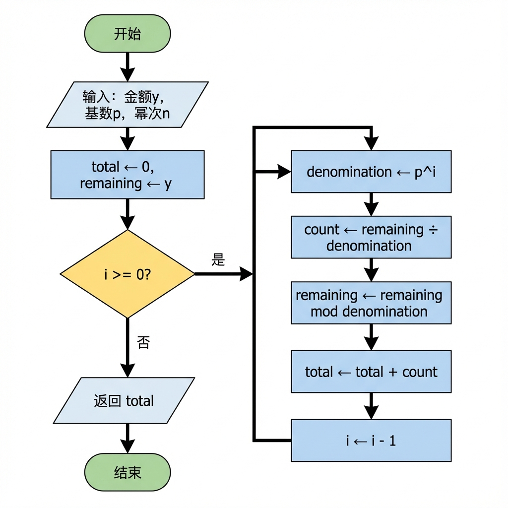
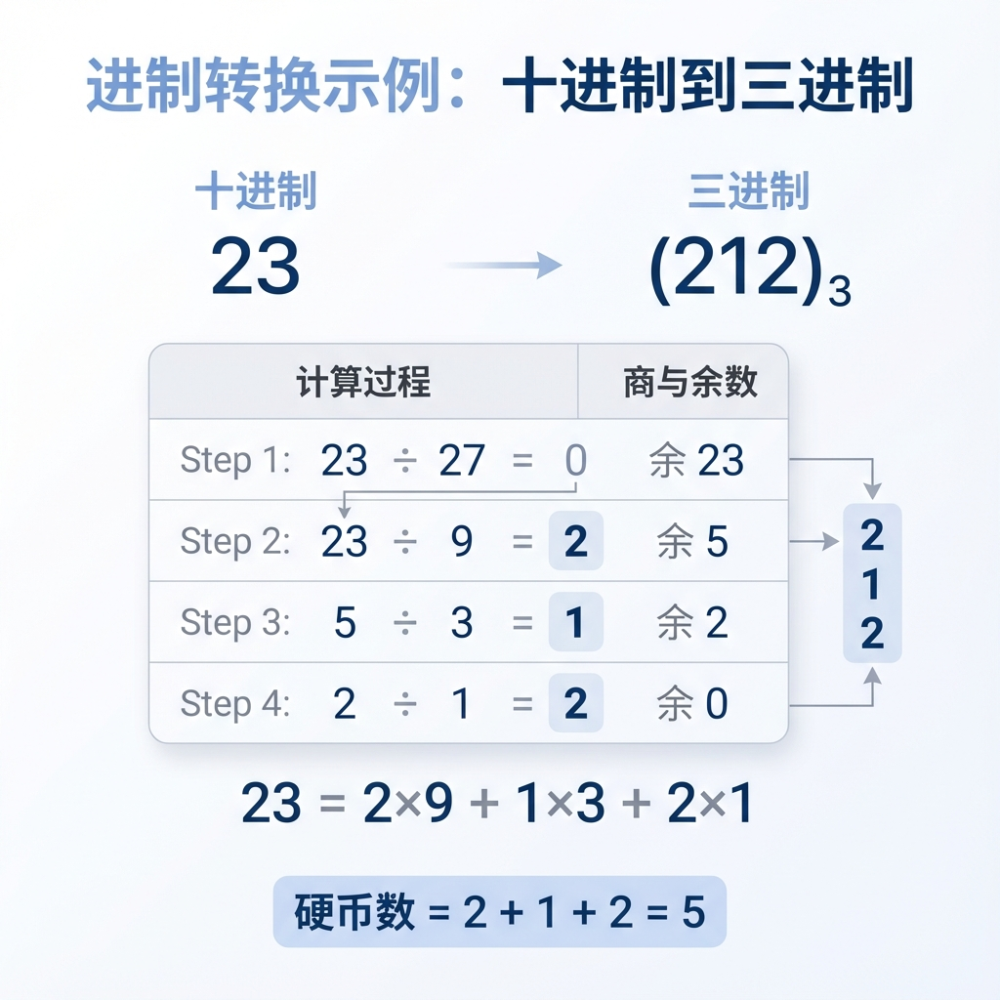
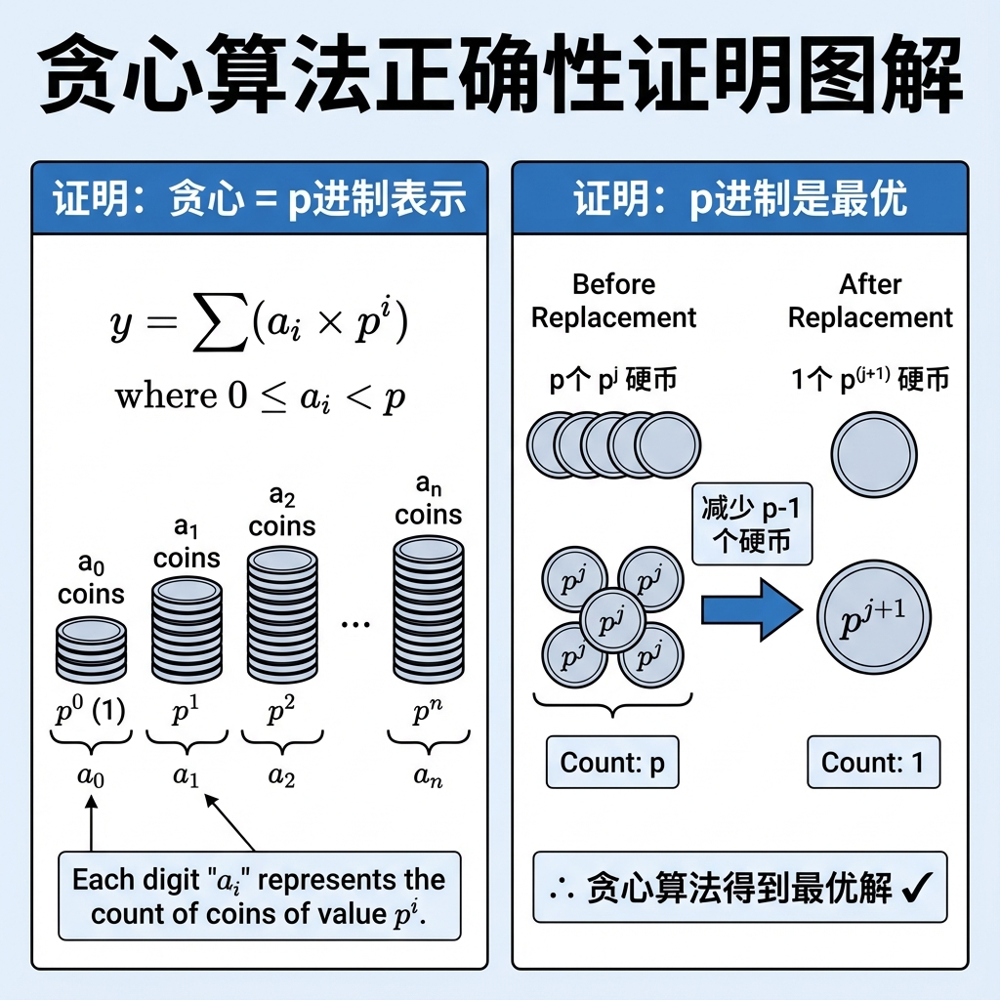
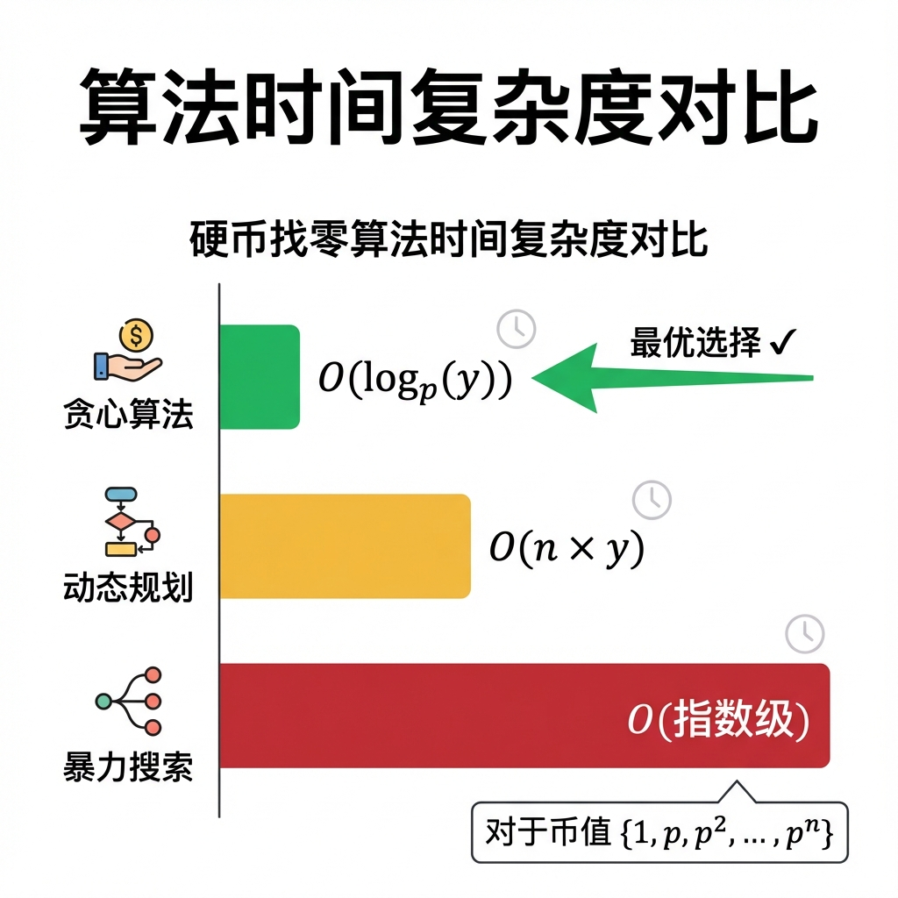

# 零钱系统问题实验报告

<div align="center">

**算法设计与分析课程**

**实验报告**

---

**题目：零钱系统问题**

**提交日期：2025年12月**

</div>

---

## 目录

1. [问题描述](#1-问题描述)
2. [问题分析](#2-问题分析)
3. [算法设计思想](#3-算法设计思想)
4. [正确性证明](#4-正确性证明)
5. [时间复杂度分析](#5-时间复杂度分析)
6. [代码实现](#6-代码实现)
7. [算法演示与验证](#7-算法演示与验证)
8. [算法对比分析](#8-算法对比分析)
9. [总结与扩展](#9-总结与扩展)
10. [参考资料](#10-参考资料)

---

## 1. 问题描述

### 1.1 原始题目

假设零钱系统的币值是 **{1, p, p², ..., pⁿ}**，其中 **p > 1**，且每个钱币的重量都等于 **1**。

设计一个**最坏情况下时间复杂度最低**的算法，使得对任何钱数 **y**，该算法得到的**零钱个数最少**。

**要求**：
1. 说明该算法的**主要设计思想**
2. **证明**它的**准确性**（正确性）
3. 给出**最坏情况下的时间复杂度**

### 1.2 相关原题

本题与以下经典问题密切相关：

| 平台 | 题目 | 关联度 | 链接 |
|------|------|--------|------|
| **洛谷** | **P1010 幂次方** | ⭐⭐⭐ 高度相关 | https://www.luogu.com.cn/problem/P1010 |
| LeetCode | 322. Coin Change | ⭐⭐ 相关 | https://leetcode.com/problems/coin-change/ |
| 洛谷 | B3635 硬币问题 | ⭐⭐ 相关 | https://www.luogu.com.cn/problem/B3635 |

> **洛谷 P1010 幂次方**是本题在 p=2 时的特例，核心思想完全相同！

### 1.3 问题形式化

**输入**：
- p：币值的基数（p > 1，正整数）
- n：最大幂次（n ≥ 0）
- y：目标金额（y ≥ 0，正整数）

**输出**：
- 最少需要的硬币个数
- （可选）每种面值硬币的使用数量

**约束**：
- 每种面值的硬币供应无限
- 必须恰好凑够金额 y
- 每个硬币重量为 1，总重量 = 总硬币数

---

## 2. 问题分析

### 2.1 币值系统特征

给定的币值系统 **{1, p, p², ..., pⁿ}** 具有以下特殊性质：



**几何级数特征**：
1. **等比数列**：公比为 p
2. **包含单位面值**：面值 1 保证任何金额都可表示
3. **倍数关系**：p^(i+1) = p × p^i

### 2.2 与进制表示的联系

**关键洞察**：币值系统 {1, p, p², ..., pⁿ} 恰好对应 **p 进制的位权**！

任何正整数 y 都可以唯一地表示为 p 进制形式：

$$y = \sum_{i=0}^{n} a_i \cdot p^i, \quad \text{其中 } 0 \leq a_i < p$$

**这意味着**：
- 每个 $a_i$ 代表使用面值 $p^i$ 的硬币数量
- 各位数字之和 $\sum a_i$ 就是需要的硬币总数

### 2.3 问题转化

| 原问题 | 等价问题 |
|--------|----------|
| 求金额 y 的最少硬币数 | 求 y 的 p 进制表示的各位数字之和 |

---

## 3. 算法设计思想

### 3.1 核心思想：贪心算法

**贪心策略**：从最大面值开始，每次尽可能多地使用当前最大面值的硬币。

**等价形式**：将金额 y 转换为 p 进制表示。



### 3.2 算法步骤

```
算法 MinCoins(y, p, n)
输入: y - 目标金额
      p - 币值基数
      n - 最大幂次
输出: 最少硬币数

1   total ← 0                    // 硬币总数
2   remaining ← y                // 剩余金额
3   FOR i ← n DOWNTO 0           // 从最大面值到最小
4       denomination ← p^i       // 当前面值
5       count ← remaining DIV denomination  // 整除
6       remaining ← remaining MOD denomination  // 取余
7       total ← total + count    // 累加硬币数
8   RETURN total
```

### 3.3 算法本质

本算法实质是**进制转换**：



**示例**：p = 3, y = 23

| 步骤 | 操作 | 当前面值 | 商（硬币数）| 余数 |
|------|------|----------|-------------|------|
| 1 | 23 ÷ 27 | 27 | 0 | 23 |
| 2 | 23 ÷ 9 | 9 | 2 | 5 |
| 3 | 5 ÷ 3 | 3 | 1 | 2 |
| 4 | 2 ÷ 1 | 1 | 2 | 0 |

**结果**：
- 23 = 2×9 + 1×3 + 2×1
- 3 进制表示：(212)₃
- 最少硬币数 = 2 + 1 + 2 = **5**

### 3.4 为什么选择贪心？

| 方法 | 适用条件 | 时间复杂度 |
|------|----------|------------|
| **贪心** | 币值为几何级数 | O(log_p(y)) |
| 动态规划 | 任意币值 | O(n × y) |
| 暴力搜索 | 任意币值 | O(指数级) |

对于本题特定的币值系统，**贪心是最优且最高效的选择**！

---

## 4. 正确性证明

### 4.1 证明目标

**定理**：对于币值系统 {1, p, p², ..., pⁿ}（p > 1），贪心算法得到的硬币数等于 y 在 p 进制下各位数字之和，且这是最少的。



### 4.2 证明第一部分：贪心结果 = p 进制表示

**命题**：贪心算法输出的各面值使用数量，恰好是 y 的 p 进制各位数字。

**证明**：

设 y 的 p 进制表示为：$y = \sum_{i=0}^{n} a_i \cdot p^i$，其中 $0 \leq a_i < p$

贪心算法执行过程：

1. **第一步**（i = n）：
   - 计算 $c_n = y \div p^n$
   - 由于 $y < p^{n+1}$，有 $c_n = a_n$
   - 剩余 $r_n = y \mod p^n = \sum_{i=0}^{n-1} a_i \cdot p^i$

2. **归纳**：对每个 i，算法计算的 $c_i$ 恰好等于 $a_i$

因此，贪心输出的硬币组合就是 p 进制表示。 ∎

### 4.3 证明第二部分：p 进制表示使用最少硬币

**命题**：p 进制表示是使用硬币数最少的方案。

**证明**（反证法）：

假设存在另一种方案 $(b_0, b_1, ..., b_n)$，满足：
1. $\sum_{i=0}^{n} b_i \cdot p^i = y$
2. $\sum_{i=0}^{n} b_i < \sum_{i=0}^{n} a_i$

**情况分析**：

**Case 1**：若存在 $b_j \geq p$

可以将 p 个 $p^j$ 硬币替换为 1 个 $p^{j+1}$ 硬币：
- 替换前硬币数：p
- 替换后硬币数：1
- **减少了 p - 1 ≥ 1 个硬币**

这说明任何 $b_j \geq p$ 的方案都不是最优的。

**Case 2**：若所有 $b_j < p$

则 $(b_0, b_1, ..., b_n)$ 是 y 的有效 p 进制表示。

由于 p 进制表示是**唯一的**，必有 $b_i = a_i$ 对所有 i 成立。

矛盾！说明不存在比 p 进制表示更优的方案。 ∎

### 4.4 贪心选择性质验证

**贪心选择性质**：在每一步选择最大面值是安全的。

```
定理：设 OPT 是最优解，若 OPT 不包含贪心选择的面值，
      则存在另一个最优解 OPT' 包含该面值。

证明：
假设贪心选择了 k 个面值 p^i 的硬币
若 OPT 使用 k' < k 个 p^i 硬币
则 OPT 必须用更多小面值硬币来补足差额 (k-k') × p^i

每替换 1 个 p^i，需要 p 个 p^(i-1)
硬币数增加 p - 1 ≥ 1

这与 OPT 最优性矛盾 ∎
```

### 4.5 证明总结

| 证明要点 | 方法 | 结论 |
|----------|------|------|
| 贪心输出 = p进制 | 归纳法 | ✓ 成立 |
| p进制是最优 | 反证法 | ✓ 成立 |
| 贪心选择安全 | 替换论证 | ✓ 成立 |

**最终结论**：贪心算法对于币值 {1, p, p², ..., pⁿ} 总是得到最优解。

---

## 5. 时间复杂度分析

### 5.1 算法分析

```c
for (int i = n; i >= 0; i--) {    // 循环 n+1 次
    int denomination = pow(p, i);  // O(1) 或 O(log i)
    count = remaining / denomination;  // O(1)
    remaining %= denomination;    // O(1)
    total += count;               // O(1)
}
```

### 5.2 时间复杂度

**每次迭代**：O(1)（假设幂运算预处理或使用底数乘法）

**迭代次数**：n + 1

**总时间复杂度**：**O(n)**

### 5.3 与 y 的关系

由于通常有 $p^n \geq y$，即 $n \geq \log_p(y)$

因此时间复杂度也可表示为：**O(log_p(y))**

```
示例：
- p = 2, y = 1000 → n ≈ 10, 时间 O(10)
- p = 10, y = 1000000 → n ≈ 6, 时间 O(6)
```

### 5.4 最坏情况分析

**最坏情况**：y = p^(n+1) - 1（p进制下所有位都是 p-1）

例如 p = 3, n = 3：y = 81 - 1 = 80 = (2222)₃

即使在最坏情况下：
- 迭代次数仍为 n + 1
- 时间复杂度仍为 **O(n) = O(log_p(y))**

### 5.5 空间复杂度

| 变量 | 空间 |
|------|------|
| coins 数组 | O(n) |
| 临时变量 | O(1) |
| **总计** | **O(n)** |

### 5.6 复杂度对比



**贪心算法是本问题的最优时间复杂度解法！**

---

## 6. 代码实现

### 6.1 伪代码

```
ALGORITHM MinCoins(y, p, n)
────────────────────────────────────────
INPUT:  y - 目标金额
        p - 币值基数 (p > 1)
        n - 最大幂次
OUTPUT: 最少硬币数

BEGIN
    total ← 0
    remaining ← y
    
    FOR i ← n DOWNTO 0 DO
        denomination ← p^i
        count ← ⌊remaining / denomination⌋
        remaining ← remaining MOD denomination
        total ← total + count
    END FOR
    
    RETURN total
END
────────────────────────────────────────
```

### 6.2 C 语言实现

```c
#include <stdio.h>
#include <math.h>

/**
 * 计算最少硬币数
 * @param y 目标金额
 * @param p 币值基数
 * @param n 最大幂次
 * @return 最少硬币数
 */
int minCoins(int y, int p, int n) {
    int total = 0;
    int remaining = y;
    
    // 从最大面值开始贪心选择
    for (int i = n; i >= 0; i--) {
        int denomination = (int)pow(p, i);  // 当前面值 p^i
        total += remaining / denomination;  // 累加硬币数
        remaining %= denomination;          // 更新剩余金额
    }
    
    return total;
}

int main() {
    int p, n, y;
    
    printf("请输入 p (币值基数): ");
    scanf("%d", &p);
    printf("请输入 n (最大幂次): ");
    scanf("%d", &n);
    printf("请输入 y (目标金额): ");
    scanf("%d", &y);
    
    int result = minCoins(y, p, n);
    printf("最少硬币数: %d\n", result);
    
    return 0;
}
```

### 6.3 优化版本（带方案输出）

```c
#include <stdio.h>
#include <math.h>

#define MAX_N 100

int minCoinsWithSolution(int y, int p, int n, int coins[]) {
    int total = 0;
    int remaining = y;
    
    // 预计算幂次，避免重复调用 pow
    int powers[MAX_N];
    powers[0] = 1;
    for (int i = 1; i <= n; i++) {
        powers[i] = powers[i-1] * p;
    }
    
    // 贪心求解
    for (int i = n; i >= 0; i--) {
        coins[i] = remaining / powers[i];
        remaining %= powers[i];
        total += coins[i];
    }
    
    return total;
}

void printSolution(int y, int p, int n, int coins[]) {
    printf("方案: %d = ", y);
    int first = 1;
    for (int i = n; i >= 0; i--) {
        if (coins[i] > 0) {
            if (!first) printf(" + ");
            printf("%d × %d^%d", coins[i], p, i);
            first = 0;
        }
    }
    printf("\n");
}
```

---

## 7. 算法演示与验证

### 7.1 示例 1：基础案例

**输入**：p = 3, n = 3, y = 23

**币值系统**：{1, 3, 9, 27}

**执行过程**：

| 步骤 | 当前面值 | 剩余金额 | 使用硬币数 | 累计 |
|------|----------|----------|------------|------|
| 初始 | - | 23 | - | 0 |
| i=3 | 27 | 23 | 0 | 0 |
| i=2 | 9 | 5 | 2 | 2 |
| i=1 | 3 | 2 | 1 | 3 |
| i=0 | 1 | 0 | 2 | 5 |

**结果**：
- 最少硬币数 = **5**
- 方案：2×9 + 1×3 + 2×1 = 18 + 3 + 2 = 23 ✓
- 3 进制表示：23 = (212)₃

### 7.2 示例 2：二进制案例（对应洛谷 P1010）

**输入**：p = 2, n = 7, y = 137

**币值系统**：{1, 2, 4, 8, 16, 32, 64, 128}

**计算过程**：
- 137 ÷ 128 = 1 ... 9
- 9 ÷ 64 = 0 ... 9
- 9 ÷ 32 = 0 ... 9
- 9 ÷ 16 = 0 ... 9
- 9 ÷ 8 = 1 ... 1
- 1 ÷ 4 = 0 ... 1
- 1 ÷ 2 = 0 ... 1
- 1 ÷ 1 = 1 ... 0

**结果**：
- 二进制：137 = (10001001)₂
- 最少硬币数 = 1 + 0 + 0 + 0 + 1 + 0 + 0 + 1 = **3**
- 方案：1×128 + 1×8 + 1×1 = 137 ✓

### 7.3 示例 3：边界案例

**输入**：p = 5, n = 3, y = 124

**币值系统**：{1, 5, 25, 125}

**计算**：
- 124 = 0×125 + 4×25 + 4×5 + 4×1
- 5 进制：(0444)₅

**结果**：最少硬币数 = 0 + 4 + 4 + 4 = **12**

### 7.4 验证正确性

对于上述示例，我们验证：

1. **硬币总值 = 目标金额** ✓
2. **结果 = p 进制各位之和** ✓
3. **每位数字 < p**（保证是标准 p 进制表示）✓

---

## 8. 算法对比分析

### 8.1 贪心 vs 动态规划

| 特征 | 贪心算法 | 动态规划 |
|------|----------|----------|
| **适用条件** | 币值为 p 的幂次 | 任意币值 |
| **时间复杂度** | O(log_p(y)) | O(n × y) |
| **空间复杂度** | O(log_p(y)) | O(y) |
| **是否最优** | ✅ 保证最优 | ✅ 保证最优 |
| **实现复杂度** | 简单 | 中等 |
| **代码行数** | ~10 行 | ~20 行 |

### 8.2 贪心失败的反例

币值 {1, 3, 4}，y = 6：

| 方法 | 方案 | 硬币数 |
|------|------|--------|
| 贪心 | 4 + 1 + 1 | 3 |
| 最优 | 3 + 3 | **2** ✅ |

**原因**：{1, 3, 4} 不是几何级数，贪心不保证最优。

### 8.3 本题币值系统的特殊性

币值 {1, p, p², ..., pⁿ} 的优势：

1. **规范货币系统**：每个大面值恰好是 p 个小面值之和
2. **无冗余选择**：不存在"跳过某个面值更优"的情况
3. **进制表示唯一性**：保证贪心解的唯一最优性

---

## 9. 总结与扩展

### 9.1 核心结论

| 要点 | 内容 |
|------|------|
| **问题** | 币值 {1, p, p², ..., pⁿ} 的最少硬币数 |
| **算法** | 贪心（= p 进制转换） |
| **正确性** | 数学归纳法 + 反证法证明 |
| **时间复杂度** | O(n) = O(log_p(y)) |
| **空间复杂度** | O(n) |

### 9.2 理论意义

本问题揭示了**贪心算法适用条件**的重要特例：

> 当硬币面值构成几何级数（等比数列）并包含 1 时，贪心算法保证最优。

这等价于数的进制表示的唯一性定理。

### 9.3 实际应用

1. **货币系统设计**：许多实际货币系统近似几何级数
   - 人民币：1, 5, 10, 50, 100
   - 美元硬币：1, 5, 10, 25 cents

2. **二进制表示**：计算机中二进制位的本质

3. **数据压缩**：利用进制表示进行编码

### 9.4 扩展思考

1. **非整数基数**：如果 p 不是整数？
   - 黄金分割币值系统（Zeckendorf 表示）

2. **有限供应**：如果每种硬币数量有限？
   - 变成多重背包问题，需要 DP

3. **多目标优化**：如果要同时最小化硬币数和总重量？
   - 需要帕累托最优分析

---

## 10. 参考资料

1. **洛谷 P1010 幂次方** - https://www.luogu.com.cn/problem/P1010
2. **LeetCode 322 Coin Change** - https://leetcode.com/problems/coin-change/
3. **洛谷 B3635 硬币问题** - https://www.luogu.com.cn/problem/B3635
4. Cormen, T.H., et al. *Introduction to Algorithms*, 3rd Edition. MIT Press.
5. 算法设计与分析课程讲义

---

<div align="center">

**— 报告结束 —**

</div>
